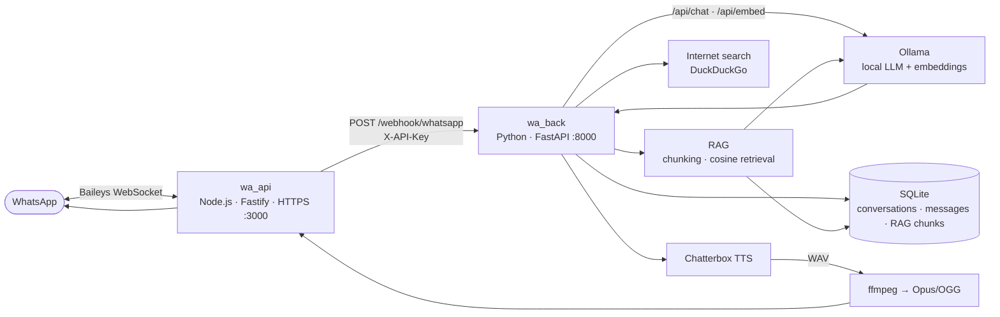

# WhatsApp AI

**A self-hosted WhatsApp AI assistant powered by a local LLM (Ollama).**

WhatsApp AI connects your WhatsApp account to a local language model so you can chat with an AI assistant directly from WhatsApp — no WhatsApp Business Cloud API, no hosted LLM provider, and no third-party gateway. Everything runs on your own machine: the WhatsApp gateway, the AI backend, the knowledge base, the database, and (optionally) text-to-speech.

The assistant answers questions, searches the web, remembers things you tell it about yourself, answers from a local knowledge base, and can reply with voice notes.

---

## Table of contents

- [Overview](#overview)
- [Quick start](#quick-start)
- [Architecture](#architecture)
- [Features](#features)
- [Tech stack](#tech-stack)
- [Project structure](#project-structure)
- [Requirements](#requirements)
- [Installation](#installation)
- [Configuration](#configuration)
- [Running the project](#running-the-project)
- [How it works](#how-it-works)
- [Tool calling](#tool-calling)
- [RAG and knowledge base](#rag-and-knowledge-base)
- [Long-term memory](#long-term-memory)
- [API](#api)
- [Authentication and security](#authentication-and-security)
- [Media and voice messages](#media-and-voice-messages)
- [API documentation](#api-documentation)
- [Troubleshooting](#troubleshooting)
- [Privacy](#privacy)
- [Limitations](#limitations)
- [Development](#development)
- [License](#license)
- [Disclaimer](#disclaimer)

---

## Overview

WhatsApp AI is a two-service application:

- **`wa_api`** — a Node.js/Fastify gateway that talks to WhatsApp through [Baileys](https://github.com/WhiskeySockets/Baileys) (the WhatsApp Web protocol). It links your WhatsApp account via QR code, receives incoming messages, downloads incoming media, and relays messages to and from the backend over HTTPS.
- **`wa_back`** — a Python/FastAPI backend that orchestrates the assistant: it persists conversations, builds prompts, calls a local LLM through [Ollama](https://ollama.com/), runs tools (internet search, time, voice generation), performs RAG retrieval over a local knowledge base, and manages per-user long-term memory.

The project is designed to be **fully self-hosted**:

- No WhatsApp Business Cloud API — a normal WhatsApp account is linked through Baileys.
- No hosted LLM — Ollama serves both the chat model and the embedding model locally.
- No external database — all state lives in SQLite on your machine.
- The only opt-in external data flow is the `search_internet` tool (DuckDuckGo).

---

## Quick start

1. **Install system dependencies:** Node.js, Python 3.10+, Ollama, and `ffmpeg`.
2. **Create your environment file:**

   ```bash
   cp .env.example .env
   # edit .env — at minimum set WEBHOOK_API_KEY and WEEBHOOK_API_KEY to the same strong value
   ```

3. **Install and configure Ollama:**

   ```bash
   ollama serve            # in a separate terminal
   ollama pull qwen3:8b
   ollama pull nomic-embed-text
   ```

4. **Install dependencies:**

   ```bash
   python3 -m venv .venv
   source .venv/bin/activate
   pip install -r requirements.txt
   cd wa_api && npm install && cd ..
   ```

5. **Index the knowledge base** (see [RAG](#rag-and-knowledge-base)):

   ```bash
   python wa_back/index_knowledge.py
   ```

6. **Start everything with one script:**

   ```bash
   ./start.sh
   ```

7. **Link your WhatsApp account:**  open `https://127.0.0.1:3000/qr` in a browser and scan it from WhatsApp (Settings → Linked devices → Link a device).

8. **Verify:** backend Swagger at <http://127.0.0.1:8000/docs>, `wa_api` Swagger at <https://127.0.0.1:3000/docs>.

9. **Say hi:** message your own number (or the linked account's number) and the assistant will reply.

See [Installation](#installation), [Configuration](#configuration), and [Running the project](#running-the-project) for the details.

---

## Architecture

WhatsApp AI runs as two independent services communicating over HTTP(S). `wa_api` owns the WhatsApp connection; `wa_back` owns the intelligence.



### Message flow, step by step

1. A WhatsApp message arrives at `wa_api` (via the Baileys WebSocket).
2. `wa_api` saves the socket session, downloads any media, and builds a normalized JSON payload: `{ id, from_, fromMe, type, text, filePath, timestamp }`.
3. `wa_api` forwards the payload to `wa_back` with a `POST /webhook/whatsapp` request carrying the `X-API-Key` header (up to 5 retries with exponential backoff).
4. `wa_back` validates the API key and queues the message as a background task, so the webhook responds immediately.
5. `wa_back` looks up (or creates) the conversation for that phone number, persists the user message to SQLite, retrieves relevant RAG context and the user's long-term memory, and loads the last 10 messages of conversation history.
6. `wa_back` builds the prompt (system prompt + RAG context + history) and calls Ollama's `/api/chat` endpoint with the configured tool definitions.
7. If the model returns tool calls, `wa_back` executes them, feeds the results back, and repeats — up to `MAX_TOOL_ITERATIONS` times.
8. When the model returns a final answer, `wa_back` persists it to SQLite and posts it back to `wa_api` (`POST /message/text`), which delivers it through Baileys.
9. If the model invoked `generate_voice`, `wa_back` synthesizes speech with Chatterbox, transcodes it to Opus/OGG with ffmpeg (inside `wa_api`), and sends it as a WhatsApp voice note (`ptt` message).
10. After replying, `wa_back` checks the user's message for personal facts and, if appropriate, writes them into the user's long-term memory.

---

## Features

**WhatsApp integration (`wa_api`)**

- WhatsApp Web / multi-device integration through Baileys.
- QR-code device linking (terminal-printable and served as an image at `GET /qr`).
- Automatic reconnect with exponential backoff (up to 10 attempts, capped at 30 s).
- Persistent authentication state on disk (`auth_info/`), so you don't re-scan the QR code on every restart.
- Incoming media handling: images, audio, documents, and videos are downloaded to `media/`.
- Graceful `logout` / `disconnect` / `connect` endpoints for session management.

**AI backend (`wa_back`)**

- Local LLM through Ollama — no hosted provider required.
- Configurable generation parameters: `temperature`, `top_p`, `top_k`.
- OpenAI-style tool calling (chat-completion tools).
- Internet search tool (DuckDuckGo) for current information.
- Time/date tool.
- Voice generation via Chatterbox multilingual TTS, including a voice-prompt (voice-cloning) sample.
- Voice-note delivery: TTS WAV is transcoded to Opus/OGG by ffmpeg and sent as a WhatsApp push-to-talk message.
- RAG over a local knowledge base (`knowledge/`) with chunking, embeddings, and cosine-similarity retrieval.
- Per-user long-term memory, isolated per phone number.
- Conversation persistence in SQLite (conversations + messages).
- Shared-secret API authentication (`X-API-Key`, constant-time comparison).
- OpenAPI/Swagger documentation for both services.

---

## Tech stack

| Technology | Purpose |
| --- | --- |
| Node.js | Runtime for `wa_api` |
| Fastify | HTTP(S) server framework for `wa_api` |
| Baileys | WhatsApp Web (multi-device) protocol client |
| pino | Structured logging in `wa_api` |
| qrcode | QR code generation for device linking |
| Python | Runtime for `wa_back` |
| FastAPI | Web framework and ASGI app for `wa_back` |
| uvicorn | ASGI server for `wa_back` |
| SQLModel / SQLAlchemy | ORM and data models (`wa_back`) |
| SQLite | Local persistence (conversations, messages, RAG chunks) |
| Ollama | Local LLM API (`/api/chat`) and embeddings API (`/api/embed`) |
| ddgs | DuckDuckGo search used by the `search_internet` tool |
| chatterbox-tts | Multilingual neural text-to-speech |
| PyTorch / torchaudio | TTS runtime and audio tensor I/O |
| ffmpeg | Opus/OGG transcoding for WhatsApp voice notes |
| mkcert | Development TLS certificates for `wa_api` HTTPS |

---

## Project structure

```
wa-ai/
├── .env.example              # Template for all environment variables
├── requirements.txt          # Python dependencies for wa_back
├── start.sh                  # One-command start (backend + wa_api, monitoring, cleanup)
├── start-dev.sh              # Development variant (auto-reload + live log tail)
├── localhost.pem             # mkcert TLS certificate used by wa_api (HTTPS)
├── localhost-key.pem         # mkcert TLS private key used by wa_api
├── knowledge/                # RAG knowledge base (.txt / .md files)
│   └── urunler.md            # Example document
├── audio/                    # TTS assets and generated voice notes
│   └── voice-file.wav        # Voice prompt used by generate_voice
├── data/                     # SQLite database files (created at runtime)
├── media/                    # Downloaded incoming media (wa_api)
├── auth_info/                # Persistent Baileys auth state (wa_api)
├── wa_api/                   # Node.js WhatsApp gateway
│   ├── package.json
│   ├── nodemon.json
│   └── src/
│       ├── server.js         # Fastify app: HTTPS, Swagger, routes, socket start
│       ├── index.js          # Standalone Baileys socket launcher (no API)
│       ├── routers.js        # HTTP routes (QR, message send, user session)
│       ├── schemas.js        # Fastify JSON request/response schemas
│       ├── dependencys.js    # Helpers: JID conversion, ffmpeg → Opus/OGG
│       └── whatsapp/
│           ├── WhatsAppClient.js         # Baileys socket wrapper / facade
│           ├── WhatsAppConnection.js     # Connection state, QR, reconnect logic
│           └── WhatsAppMessageService.js # Media download + webhook forwarding
└── wa_back/                  # Python AI backend
    ├── main.py               # FastAPI app entry point
    ├── database.py           # SQLModel engine + sessions
    ├── crud.py               # Database operations
    ├── systemPromt.py        # System prompt (assistant persona and rules)
    ├── index_knowledge.py    # CLI: index knowledge/ files into RAG
    ├── schemas/              # Pydantic + SQLModel schemas
    ├── routers/              # FastAPI routers (webhook, tools, Ollama helpers)
    ├── dependencies/         # Settings, auth, LLM, RAG, tools, WhatsApp client
    └── rag/                  # Embedding, chunking, indexing, retrieval
```

Key directories explained:

- **`knowledge/`** — plain-text (`.txt`) or Markdown (`.md`) documents that make up the assistant's knowledge base. Run `index_knowledge.py` after adding or changing files.
- **`audio/`** — the `elevenlab-ahu.wav` file is the voice prompt used when generating speech. Generated voice notes are also written here.
- **`media/`** — incoming images/audio/documents/videos are stored here by `wa_api`.
- **`auth_info/`** — Baileys' multi-file authentication state. **Treat as secret** — this is what keeps you logged in. It is git-ignored.
- **`wa_back/systemPromt.py`** — the system prompt that defines the assistant's persona and behavior. Edit it to change how the assistant behaves.
- **`wa_back/rag/rag_service.py`** — embedding, chunking, indexing, and retrieval logic (see [RAG and knowledge base](#rag-and-knowledge-base)).

---

## Requirements

### Runtime

- **Node.js** — a current LTS release. `wa_api` depends on Fastify 5 and Baileys 7, which target modern Node.
- **Python** — 3.10 or newer (pydantic v2 / SQLModel require a recent Python).
- **Ollama** — running locally (default endpoint `http://localhost:11434`) with:
  - a chat model that supports tool calling — the default is `qwen3:8b`;
  - an embedding model — the default is `nomic-embed-text`.
- **ffmpeg** — on `PATH`. Required to transcode TTS output (WAV) to Opus/OGG for WhatsApp voice notes.

### Text-to-speech (optional but enabled by default in the model)

The `generate_voice` tool uses [Chatterbox](https://github.com/facebookresearch/chatterbox) via `chatterbox-tts`, which runs on PyTorch:

- **PyTorch and torchaudio** must be installed in the Python environment. They are not pinned in `requirements.txt` (which only pins `chatterbox-tts`), so install them explicitly on platforms that need it, e.g. `pip install torch torchaudio`.
- **CPU** is the default (`DEVICE=cpu`) and works but is slow. If you want GPU synthesis, install a CUDA-enabled PyTorch build and set `DEVICE=cuda`.

### TLS certificates

`wa_api` serves HTTPS using the mkcert-generated `localhost.pem` / `localhost-key.pem` shipped in the repo root. `wa_back` verifies `wa_api`'s certificate when it sends messages, using the CA path in `WHATSAPP_SSL_PATH` (default `mkcert/rootCA.pem`). That CA file is machine-specific and **not** committed to the repository — see [Installation](#installation) to set it up.

> These certificates are development certificates. If you expose the service beyond your machine, replace them with certificates your clients actually trust.

---

## Installation

### 1. Clone and prepare

```bash
git clone https://github.com/Mehmetyenerm/whatsapp_ai
cd whatsapp_ai
cp .env.example .env
```

Open `.env` and at minimum set a strong, shared value for `WEBHOOK_API_KEY` (used by `wa_back`) and `WEEBHOOK_API_KEY` (used by `wa_api` — see the note in [Configuration](#configuration)). They must match.

### 2. Install and configure Ollama

Install Ollama from <https://ollama.com>, then:

```bash
ollama serve                # start the server (or run it as a service)
ollama pull qwen3:8b        # chat model (tool-calling capable)
ollama pull nomic-embed-text  # embedding model for RAG
```

Verify with `curl http://localhost:11434/api/tags` — you should see both models listed.

> You can use any Ollama chat model that supports tool calling; if you change it, update `MODEL` in `.env`. `nomic-embed-text` is a good general-purpose embedding model and is the tested default.

### 3. Install `wa_back` (Python)

```bash
python3 -m venv .venv
source .venv/bin/activate
pip install -r requirements.txt
```

For voice generation, also ensure PyTorch and torchaudio are available (see [Requirements](#requirements)):

```bash
pip install torch torchaudio
```

### 4. Install `wa_api` (Node.js)

```bash
cd wa_api
npm install
cd ..
```

### 5. Set up TLS for `wa_api`

`wa_api` needs a certificate and key named `localhost.pem` and `localhost-key.pem` in the project root (they are included, but you should regenerate your own), plus a root CA that `wa_back` can use to verify `wa_api`.

With [mkcert](https://github.com/FiloSottile/mkcert):

```bash
mkcert -install
mkcert localhost 127.0.0.1
# rename the generated files to localhost.pem and localhost-key.pem in the project root
mkdir -p mkcert
cp "$(mkcert -CAROOT)/rootCA.pem" mkcert/rootCA.pem
```

`WHATSAPP_SSL_PATH` (default `mkcert/rootCA.pem`) tells `wa_back` where that CA lives.

### 6. Install `ffmpeg`

```bash
# Debian/Ubuntu
sudo apt install ffmpeg
# macOS
brew install ffmpeg
```

Verify with `ffmpeg -version`.

### 7. Prepare the knowledge base

Put your reference documents (`.txt` or `.md`) in `knowledge/`. Then index them:

```bash
python wa_back/index_knowledge.py
```

The script creates the database if needed and prints how many chunks were indexed per file. Run it again whenever you add, edit, or remove a knowledge document (re-indexing the same file replaces its old chunks).

### 8. (Optional) Prepare TTS

By default `generate_voice` uses `audio/voice-file.wav` as the voice prompt. Replace this file with your own prompt if you want a different voice. Voice generation works out of the box on CPU; use `DEVICE=cuda` for GPU synthesis.

---

## Configuration

All configuration lives in `.env` in the project root (both services load it from there). Copy `.env.example` to `.env` and adjust.

### `wa_back` — server

| Variable | Default | Required | Description |
| --- | --- | --- | --- |
| `HOST` | `127.0.0.1` | no | Address the FastAPI backend binds to. |
| `PORT` | `8000` | no | Port the FastAPI backend listens on. |
| `LOG_LEVEL` | `DEBUG` | no | Logging level for the backend. |
| `DATABASE_URL` | `sqlite:///data/app.db` | no | SQLite connection URL. |

### `wa_back` — LLM (Ollama)

| Variable              | Default                  | Required | Description                                                               |
|-----------------------|--------------------------| --- |---------------------------------------------------------------------------|
| `OLLAMA_URL`          | `http://localhost:11434` | no | Base URL of the Ollama server.                                            |
| `MODEL`               | `qwen3:8b`               | no | Chat model used for responses (must support tool calling).                |
| `EMBED_MODEL`         | `nomic-embed-text`       | no | Embedding model used for RAG and memory.                                  |
| `DEVICE`              | `cpu`                    | no | Device for TTS (`cpu` or `cuda`).                                         |
| `VOICE_FILE`          | `voice-file.wav`         | no | Voice file for TTS.                                                       |
| `VOICE_LANG`          | `tr`                     | no | Language selector for TTS (Write only ChatterboxTTS supported languages). |
| `TEMPERATURE`         | `0.7`                    | no | Generation temperature passed to Ollama.                                  |
| `TOP_P`               | `0.9`                    | no | Top-p sampling parameter.                                                 |
| `TOP_K`               | `40`                     | no | Top-k sampling parameter.                                                 |
| `MAX_TOOL_ITERATIONS` | `5`                      | no | Maximum number of model↔tool rounds before giving up.                     |

### `wa_back` — WhatsApp client / webhook

| Variable | Default | Required | Description |
| --- | --- | --- | --- |
| `WHATSAPP_API_URL` | `https://localhost:3000` | no | Base URL of `wa_api` (used to send messages back). |
| `WHATSAPP_SSL_PATH` | `mkcert/rootCA.pem` | no | CA certificate used to verify `wa_api`'s HTTPS certificate. |
| `WEBHOOK_API_KEY` | `change-me` | yes | Shared secret checked on every webhook/API call (`X-API-Key`). Minimum 8 characters (enforced). |

### `wa_api` — server and WhatsApp

| Variable | Default | Required | Description |
| --- | --- | --- | --- |
| `API_HOST` | `127.0.0.1` | yes | Address `wa_api` binds to (HTTPS). |
| `API_PORT` | `3000` | yes | Port `wa_api` listens on. |
| `AUTH_PATH` | `auth_info` | yes | Directory where Baileys persists the WhatsApp session. |
| `MEDIA_PATH` | `media` | yes | Directory where incoming media is downloaded. |
| `LOG_LEVEL` | `debug` | no | Logging level for `wa_api` (pino). |
| `FASTAPI_ENDPOINT_URL` | `http://127.0.0.1:8000/webhook/whatsapp` | yes | Backend webhook to forward incoming messages to. |
| `WEEBHOOK_API_KEY` | `change-me` | yes | API key sent in the `X-API-Key` header when forwarding to the backend. |
| `FASTAPI_OPEN` | `true` | no | **Currently unused** — reserved for a future toggle. |

> ⚠️ **Note the spelling:** `wa_api` reads `WEEBHOOK_API_KEY` (with the typo). This is the actual variable name in the code. Set both `WEBHOOK_API_KEY` (backend) and `WEEBHOOK_API_KEY` (gateway) to the **same** value or message forwarding will be rejected with `401 Unauthorized`.

### Example `.env`

```dotenv
# wa_back
# Sunucu Ayarları
HOST=127.0.0.1
PORT=8000

# LLM Ayarları (Ollama)
OLLAMA_URL=http://localhost:11434
MODEL=qwen3:8b
EMBED_MODEL=nomic-embed-text
DEVICE=cpu

#Tool Ayarlari
VOICE_FILE=voice-file.wav
VOICE_LANG=tr

# WhatsApp API Ayarları
WHATSAPP_API_URL=https://localhost:3000
WHATSAPP_SSL_PATH=mkcert/rootCA.pem

# Veritabanı
DATABASE_URL=sqlite:///data/app.db

# Webhook Güvenliği (ÖNEMLI: Güvenli bir değer seç)
WEBHOOK_API_KEY=change-me

# Logging
LOG_LEVEL=DEBUG

# LLM Parametreleri
MAX_TOOL_ITERATIONS=5
TOP_K=40
TOP_P=0.9
TEMPERATURE=0.7

# wa_api ===
# Sunucu Ayarları
API_HOST=127.0.0.1
API_PORT=3000

# Dosya Yolları
AUTH_PATH=auth_info
MEDIA_PATH=media
LOG_LEVEL=debug

# Backend Ayarları
FASTAPI_ENDPOINT_URL=http://127.0.0.1:8000/webhook/whatsapp
FASTAPI_OPEN=true

# Webhook Güvenliği (ÖNEMLI: Aynı WEBHOOK_API_KEY olmalı)
WEEBHOOK_API_KEY=change-me
```

---

## Running the project

### One-command start

Both `start.sh` and `start-dev.sh` do the following automatically:

1. Check that `.env` exists and that Python and Node.js are installed.
2. Create `auth_info/`, `media/`, `data/`, `knowledge/` if missing.
3. Create the Python virtual environment (`.venv`) and install `requirements.txt` if needed.
4. Run `npm install` inside `wa_api` on first run.
5. Start the FastAPI backend (port `8000`) and then `wa_api` (port `3000`), with both redirected to `backend.log` and `wa_api.log`.

```bash
./start.sh
```

- `start.sh` runs backend + `wa_api` and monitors both, shutting down cleanly on `Ctrl+C`.
- `start-dev.sh` is the development variant: it starts uvicorn with `--reload`, `npm run dev` (nodemon), and tails both logs inline.

### Manual start

Backend:

```bash
source .venv/bin/activate
cd wa_back
uvicorn main:app
```

`wa_api`:

```bash
cd wa_api
npm start
```

### Startup order

Start **Ollama first**, then the **backend**, then `wa_api`. The backend creates the SQLite schema on startup, and `wa_api` needs the backend URL configured. `wa_api` will keep trying to reconnect to WhatsApp independently, so a temporary backend outage does not kill the WhatsApp connection.

### Linking your WhatsApp account (QR code)

1. Start the services and  open **<https://127.0.0.1:3000/qr>** in a browser (you'll need to accept the self-signed certificate warning).
2. In the WhatsApp mobile app, go to **Settings → Linked devices → Link a device**.
3. Scan the QR code shown.
4. Once connected you'll see the linked device in your WhatsApp account. The session is persisted in `auth_info/`, so future restarts won't require re-scanning (unless you log out).

### Verifying both services

| Service | Health check | Docs |
| --- | --- | --- |
| `wa_back` | `curl http://127.0.0.1:8000/` → `{"Message":"Hello World"}` | <http://127.0.0.1:8000/docs> |
| `wa_api` | `curl -k https://127.0.0.1:3000/` → `{"hello":"world"}` | <https://127.0.0.1:3000/docs> |
| Ollama | `curl http://localhost:11434/api/tags` | — |

You can also check the linked-device list in the WhatsApp mobile app, and watch for `Whatsapp connected` in `wa_api.log`.

---

## How it works

The full lifecycle of an incoming WhatsApp message:

1. **A WhatsApp message arrives** — the user sends a text, image, audio, document, or video message to the linked account.
2. **Baileys receives it** — `WhatsAppClient` listens for `messages.upsert` events (`type === "notify"`).
3. **`wa_api` downloads media if necessary** — images are saved as `media/<id>.jpg`, audio as `media/<id>.ogg`, video as `media/<id>.mp4`, documents under their original filename.
4. **`wa_api` forwards a normalized payload** — `{ id, from_, fromMe, type, text, filePath, timestamp }` is POSTed to `FASTAPI_ENDPOINT_URL` with the `X-API-Key` header (up to 5 attempts with exponential backoff).
5. **`wa_back` persists the message** — it looks up (or creates) the conversation for the sender's phone number and stores the user message in SQLite.
6. **Long-term memory is retrieved** — personal memory chunks for that phone number are pulled from RAG.
7. **RAG knowledge is retrieved** — relevant chunks from the general knowledge base are pulled from RAG.
8. **Conversation history is loaded** — the last 10 messages of that conversation are loaded, oldest first.
9. **A prompt is constructed** — system prompt + RAG context + history, sent as `messages` to Ollama.
10. **Ollama generates a response or requests a tool** — the model either returns text or a `tool_calls` array.
11. **Tools are executed when requested** — each tool call is dispatched to its implementation (see [Tool calling](#tool-calling)); invalid or unknown calls return an error to the model instead of failing.
12. **Tool results are returned to the model** — results are appended as `role: "tool"` messages and Ollama is called again (steps 10–12 repeat, bounded by `MAX_TOOL_ITERATIONS`).
13. **The final response is generated** — when the model stops requesting tools, its text is the answer.
14. **`wa_back` sends the response through `wa_api`** — it POSTs to `POST /message/text` (or `POST /message/audio` for voice), and `wa_api` delivers it via Baileys. The assistant message is also persisted to SQLite.
15. **If voice is requested** — `generate_voice` synthesizes speech with Chatterbox (WAV), `wa_api` transcodes it to Opus/OGG with ffmpeg, and it's sent as a push-to-talk voice note.

After replying, `wa_back` evaluates the user's message for personal facts and may store them in the user's long-term memory (see [Long-term memory](#long-term-memory)).

---

## Tool calling

Tools are declared to Ollama as chat-completion `tools` and are executed locally by `wa_back`. When the model returns a `tool_calls` array, each call is executed, the result is appended as a `role: "tool"` message, and the loop continues.

The loop is bounded by `MAX_TOOL_ITERATIONS` (default `5`). If the model keeps requesting tools beyond that, `wa_back` returns a fallback message ("Sorry, I can't complete your request right now…").

The three tools defined in `wa_back/dependencies/tool_dep.py`:

### `search_internet(query)`

Searches the live internet via DuckDuckGo (`ddgs`) and returns up to 10 results with `title`, `body`, and `href`. Used for current events, news, weather, prices, sports, or anything that may have changed. On failure it returns an empty list so the model can continue gracefully.

### `get_time()`

Returns the current date and time.

### `generate_voice(text)`

Synthesizes `text` into speech with Chatterbox TTS (voice prompt `audio/voice-file.wav`, language `tr`), saves a WAV to `audio/<phone>.wav`, sends it through `wa_api` as a WhatsApp voice note, and returns the delivery result. The phone number is injected automatically by `wa_back` — it is not something the model provides.

> The system prompt instructs the model to spell out numbers before calling `generate_voice`, and to only use the tool when the user actually asks for a voice response.

The tool definitions (names, descriptions, JSON schemas) live in the `tools` list in `wa_back/dependencies/tool_dep.py`. To add a new tool, define it there, add an implementation, and register it in `TOOL_IMPLEMENTATIONS` in `wa_back/dependencies/llm_dep.py`.

---

## RAG and knowledge base (Untested)

Files under `knowledge/` (`.txt` and `.md`) are the assistant's local knowledge base.

**Indexing** — `python wa_back/index_knowledge.py`:

1. Reads every `.txt` / `.md` file under `knowledge/` (UTF-8).
2. Splits each document into overlapping character chunks (`chunk_size=900`, `overlap=150`).
3. Embeds each chunk with Ollama's `/api/embed` endpoint using `EMBED_MODEL` (`nomic-embed-text`).
4. Stores the chunks in the `rag_chunks` SQLite table (`source`, `chunk_index`, `content`, `embedding`).
5. Re-indexing the same file replaces its old chunks (same `source` → old rows deleted first), so documents can be updated in place.

**Retrieval** — on each message, `wa_back`:

1. Embeds the user's question.
2. Computes **cosine similarity** between the query vector and every chunk vector (brute force over the chunk table).
3. Keeps the top `k=4` chunks with `score >= min_score` (0.35), excluding personal-memory chunks for the general search.
4. Also retrieves the top personal-memory chunks for that user (see below).
5. Merges both lists, sorts by score, and injects the top 6 into the prompt as a system-level RAG context block.

The system prompt instructs the model to treat RAG context as reference data, not instructions, and not to invent answers when the context doesn't contain them.

The **general knowledge namespace** (chunks whose `source` is a file path under `knowledge/`) is shared across all users. The **per-user memory namespace** (`memory:user:<phone>:...`) is excluded from the general search and only ever retrieved for the matching user.

---

## Long-term memory (Untested)

In addition to the shared knowledge base, the assistant maintains **personal long-term memory per user**.

- After answering, `wa_back` inspects the user's message with a lightweight filter. Messages that look like personal/durable facts (e.g. containing Turkish memory markers such as "benim", "adım", "ismim", "yaşım", "seviyorum", "hatırla", "tercih ederim") and are under 600 characters are eligible.
- Eligible messages are embedded and stored as RAG chunks under the source namespace **`memory:user:<phone>:<uuid>`**.
- Each memory gets a unique source id, so new memories don't overwrite old ones. (Re-saving the same source would replace its chunks — a mechanism intended for future memory-update flows.)
- **Isolation:** the general RAG search explicitly excludes the `memory:user:` prefix, and personal memory is only retrieved with the exact prefix `memory:user:<phone>:` for the current sender. One user's memories are never injected into another user's context.
- Memory is injected into the prompt only as RAG context, and the system prompt tells the model to use it only when answering that same user, and to ask for confirmation if the memory looks old or contradictory.

Because memory lives in the same SQLite `rag_chunks` table as the knowledge base, it is local to your machine and is never sent anywhere.

---

## API

Authentication: endpoints marked 🔒 require an `X-API-Key` header whose value must match `WEBHOOK_API_KEY` (backend). See [Authentication and security](#authentication-and-security).

### `wa_back` (FastAPI, port 8000)

| Method | Path | Auth | Purpose |
| --- | --- | --- | --- |
| `GET` | `/` | — | Health check (`{"Message": "Hello World"}`). |
| `POST` | `/webhook/whatsapp` | 🔒 | Receives a normalized message payload from `wa_api` and queues it for background processing. Returns `{"status": "received"}`. |
| `POST` | `/tool/websearch?query=<q>` | 🔒 | Runs an internet search directly and returns the results. |
| `GET` | `/tool/generate_audio?content=<text>&number=<phone>` | 🔒 | Generates a voice note for the given number in the background. Returns `{"status": "received"}`. |
| `GET` | `/tool/send_voice?number=<phone>&path=<wav>` | 🔒 | Sends an existing audio file path as a WhatsApp voice note. |
| `GET` | `/models` | — | Lists models available in Ollama (proxies `/api/tags`). |
| `POST` | `/models/download?model_name=<name>` | 🔒 | Pulls a model in Ollama (proxies `/api/pull`). |
| `GET` | `/conversation` | 🔒 | Lists all stored conversations. |

Webhook request body (`WhatsAppMessage`):

```json
{
  "id": "A4B…",
  "from_": "901234567890@s.whatsapp.net",
  "fromMe": false,
  "type": "text",
  "text": "Hello!",
  "filePath": null,
  "timestamp": 1724800000
}
```

### `wa_api` (Fastify, HTTPS port 3000)

No API key on these routes — access is limited by binding to `127.0.0.1` by default (keep it that way; see [Security recommendations](#authentication-and-security)).

| Method | Path | Purpose |
| --- | --- | --- |
| `GET` | `/` | Health check (`{"hello": "world"}`). |
| `GET` | `/qr` | Returns the current WhatsApp pairing QR code as a PNG image (404 until one is generated). |
| `POST` | `/message/text` | Send a text message. Body: `{"to": 901234567890, "message": "hi"}`. |
| `POST` | `/message/audio` | Send an audio file as a WhatsApp voice note. Body: `{"to": 901234567890, "filePath": "/abs/path.wav"}`. `wa_api` transcodes to Opus/OGG. |
| `POST` | `/message/image` | Send an image. Body: `{"to": 901234567890, "filePath": "/abs/path.jpg"}`. |
| `POST` | `/message/media` | Send a `.jpg` image or `.ogg` audio file. Body: `{"to": 901234567890, "filePath": "/abs/path.ogg"}`. |
| `GET` | `/user/logout` | Log out of WhatsApp (clears the session so the QR code must be scanned again). |
| `GET` | `/user/disconnect` | Disconnect the socket (session data is kept). |
| `GET` | `/user/connect` | (Re)connect the socket. |

Text message response example:

```json
{ "success": true, "messageId": "3EB0…" }
```

---

## Authentication and security

**Shared-secret authentication.** `wa_back` protects its webhook and tool endpoints with a shared secret. Every call must include the header:

```
X-API-Key: <your-secret>
```

The value is checked against `WEBHOOK_API_KEY` using `secrets.compare_digest` (constant-time comparison, which avoids timing attacks). `wa_api` sends this header automatically using `WEEBHOOK_API_KEY`, so the two variables must contain the same value.

**`wa_api` routes are unauthenticated** and are bound to `127.0.0.1` by default. Do not expose port 3000 to the network without adding your own authentication or a reverse proxy.

**Security recommendations:**

- Set `WEBHOOK_API_KEY` / `WEEBHOOK_API_KEY` to a long random value (`openssl rand -hex 32`). The backend enforces a minimum of 8 characters.
- Keep both services bound to `127.0.0.1` unless you have a specific reason to expose them.
- Keep `auth_info/` private — it contains your WhatsApp session credentials.
- Replace the bundled development TLS certificates with real ones before exposing `wa_api`.
- Run on a machine you control and keep it patched.

**Important:** Linking an ordinary WhatsApp account through Baileys is **not** the official WhatsApp Business Cloud API. It is an unofficial client of WhatsApp Web and is not supported or endorsed by WhatsApp/Meta. It may violate WhatsApp's Terms of Service, can stop working when WhatsApp changes its protocol, and carries a risk that the linked account could be temporarily or permanently restricted. Use a dedicated number you can afford to lose, and read the [Disclaimer](#disclaimer).

---

## Media and voice messages

**Incoming media.** `wa_api` handles images, audio, documents, and videos:

- Image → `media/<message-id>.jpg`
- Audio → `media/<message-id>.ogg`
- Video → `media/<message-id>.mp4`
- Document → `media/<original-file-name>` (falls back to `media/<message-id>.bin`)

Each download is passed to the backend as `filePath` in the webhook payload, so the assistant can reference it (e.g. for image captions or documents). The download directory is set with `MEDIA_PATH`.

**Outgoing voice notes.** The voice pipeline:

```
Chatterbox TTS  →  WAV (audio/<phone>.wav)  →  ffmpeg  →  Opus/OGG  →  WhatsApp ptt voice note
```

1. `wa_back` synthesizes `audio/<phone>.wav` with Chatterbox (using `audio/elevenlab-ahu.wav` as the voice prompt).
2. `wa_back` POSTs the WAV path to `wa_api`'s `POST /message/audio`.
3. `wa_api` runs `ffmpeg` (`libopus`, mono) producing a `<name>_converted.ogg` next to the input.
4. Baileys sends the OGG with `mimetype: "audio/ogg; codecs=opus"` and `ptt: true`, which renders as a push-to-talk voice message in WhatsApp.

---

## API documentation

Both services expose interactive OpenAPI/Swagger documentation:

- **`wa_back`:** <http://127.0.0.1:8000/docs> (FastAPI's built-in Swagger UI; the OpenAPI JSON is at `/openapi.json`).
- **`wa_api`:** <https://127.0.0.1:3000/docs> (Fastify Swagger UI; served at the `docs` route prefix).

Remember that `wa_api` is HTTPS with a self-signed certificate — your browser will ask you to accept the certificate first.

---

## Troubleshooting

### QR code / device linking

- **No QR appears.** `GET /qr` returns 404 until Baileys produces a QR code. Watch `wa_api.log`; if the log shows `Whatsapp connected`, the device is already linked and no QR will be issued. Use `GET /user/logout` to force a fresh link.
- **QR expires.** WhatsApp QR codes expire after a short time; refresh the page / restart and scan promptly.
- **Browser shows a certificate warning.** Expected — `wa_api` uses a self-signed dev certificate. Proceed manually or serve through your own trusted TLS setup.

### Baileys reconnect / authentication

- **Reconnect attempts stop.** The connection logic allows up to 10 reconnect attempts with exponential backoff (capped at 30 s). If you hit `Maximum reconnect attempts reached`, restart `wa_api`.
- **`loggedOut`.** The socket logs out and clears `auth_info/`; you must scan the QR code again. Re-linking requires the phone to be online and, occasionally, for you to log out of the old linked device first.
- **Auth state is corrupt.** Stop `wa_api`, delete the `auth_info/` directory, and restart to re-link from scratch.
- **Old/duplicate linked devices.** Remove stale linked devices from WhatsApp → Settings → Linked devices.

### Ollama connection / model errors

- **`Error fetching models` / backend can't reach Ollama.** Confirm `ollama serve` is running and `OLLAMA_URL` is correct (`curl http://localhost:11434/api/tags`).
- **Model not found.** Run `ollama pull qwen3:8b` and `ollama pull nomic-embed-text` (or match `MODEL`/`EMBED_MODEL` to models you actually have).
- **Tool calling doesn't work / model repeats.** `MODEL` must be a tool-calling-capable model (the default `qwen3:8b` is one). If tools fail, lower `MAX_TOOL_ITERATIONS` or switch models.
- **Slow responses.** Generation runs on CPU by default. A larger model or a GPU build of Ollama will help.

### RAG / embeddings

- **No answers from the knowledge base.** Make sure you ran `python wa_back/index_knowledge.py` and it reported indexed chunks. Check `EMBED_MODEL` is pulled.
- **Docs changed but answers are stale.** Re-run the indexer — re-indexing the same file replaces its old chunks.
- **`embedding count doesn't match chunk count`.** This is an Ollama/embedding-model hiccup; retry or restart Ollama.
- **Retrieval returns nothing.** The retrieval threshold is `min_score=0.35`; highly dissimilar content is filtered out by design. Add or rewrite knowledge documents to be closer to the questions you ask.

### TTS / ffmpeg

- **`ModuleNotFoundError: torchaudio`.** Install `pip install torch torchaudio` in the virtual environment.
- **Voice tool returns "fail".** Check the backend log for the exception. Common causes: missing `audio/elevenlab-ahu.wav`, no CUDA when `DEVICE=cuda` is set, or a missing voice prompt file.
- **`ffmpeg not found`.** Install ffmpeg and make sure it's on `PATH`. Voice notes require it (WAV → Opus/OGG).
- **Slow voice generation.** Chatterbox on CPU is slow. Set `DEVICE=cuda` with a CUDA-enabled PyTorch build for GPU synthesis.
- **Audio sent as a file, not a voice note.** The audio must go through `wa_api`'s `/message/audio` path, which sets `ptt: true`. Sending a WAV directly via other endpoints will not produce a voice note.

### Webhook / API-key errors

- **`401 Unauthorized` on the webhook.** `WEEBHOOK_API_KEY` (wa_api) and `WEBHOOK_API_KEY` (wa_back) don't match. Note the spelling — `WEEBHOOK_API_KEY` is the real variable name used by `wa_api`.
- **Messages aren't reaching the backend.** Confirm `FASTAPI_ENDPOINT_URL` points at `http://<host>:<port>/webhook/whatsapp` and that both services are running. `wa_api` retries 5 times, then drops the message.
- **Backend can't POST to `wa_api` (`ssl` errors).** `WHATSAPP_SSL_PATH` must point at the CA that signed `localhost.pem` (e.g. `mkcert/rootCA.pem`). A mismatch produces certificate-verification errors in `backend.log`.

### Media processing

- **Incoming media isn't saved.** Check that `MEDIA_PATH` exists and is writable, and watch `wa_api.log` for download errors.
- **Documents with unusual names.** Document files use their original filename; unusual encodings or characters may need manual handling.

---

## Privacy

This project is designed to be **fully local**:

- WhatsApp messages, conversations, assistant replies, SQLite data, RAG chunks, embeddings, and the knowledge base all live on your machine.
- The LLM and embedding calls go to **your local Ollama** — no prompt or conversation content is sent to a hosted LLM provider.
- Text-to-speech is local (Chatterbox).

**The one exception is the internet search tool.** When the model invokes `search_internet`, the query is sent to DuckDuckGo as an ordinary web search — that is an external data flow, initiated by the model at runtime. Searches happen only when the tool is invoked, and the search backend can be removed by editing the tools in `wa_back/dependencies/tool_dep.py`.

Also note the WhatsApp connection itself is a link to WhatsApp's servers (that's how Baileys works); incoming and outgoing messages necessarily transit WhatsApp's infrastructure.

---

## Limitations

- **Unofficial WhatsApp client.** The project depends on Baileys and the WhatsApp Web protocol, which are not officially supported and can break or cause account restrictions at any time. See the [Disclaimer](#disclaimer).
- **Local hardware requirements.** The LLM runs through local Ollama; quality and speed depend on your hardware. Large models on CPU can be slow. RAG embeddings also run locally.
- **TTS resource requirements.** Chatterbox TTS on CPU is computationally expensive; GPU (`DEVICE=cuda`) is recommended for usable voice-response latency. PyTorch/torchaudio must be installed explicitly.
- **Brute-force retrieval.** RAG retrieval computes cosine similarity against every chunk in the `rag_chunks` table on every message. Fine for small knowledge bases, but it does not scale to very large corpora.
- **Model/tool-calling compatibility.** Tools are declared as OpenAI-style functions. The configured `MODEL` must support tool calling; models without reliable tool support will degrade or fail the loop. If `MAX_TOOL_ITERATIONS` is exceeded, the assistant returns a fallback message.
- **Conversation addressing.** Conversations are keyed by numeric phone number. Messages from group chats (JIDs such as `<id>@g.us`) are not handled and are logged as errors by the backend.
- **Account/session reliability.** Reconnects are bounded (10 attempts), the session can be invalidated remotely (logout), and WhatsApp can disconnect or rate-limit unofficial clients.
- **Media handling is type-specific.** Outgoing `/message/media` supports `.jpg` and `.ogg`; sending other types through that endpoint is rejected.

---

## Development

### Running each service in development

`wa_back` (auto-reload on code changes):

```bash
source .venv/bin/activate
cd wa_back
uvicorn main:app --reload
```

`wa_api` (auto-reload via nodemon):

```bash
cd wa_api
npm run dev
```

Or run both with live log tails in one terminal: `./start-dev.sh`.

### Where to extend things

- **Assistant behavior / persona:** edit `wa_back/systemPromt.py` (the system prompt). This is where the assistant's style, rules, and tool-usage instructions are defined.
- **New tools:** add the tool definition to the `tools` list in `wa_back/dependencies/tool_dep.py`, implement it there (or import it), and register it in `TOOL_IMPLEMENTATIONS` in `wa_back/dependencies/llm_dep.py`.
- **Knowledge base:** add `.txt`/`.md` files under `knowledge/` and re-run `python wa_back/index_knowledge.py`.
- **RAG behavior (chunk size, overlap, thresholds):** `wa_back/rag/rag_service.py` and `wa_back/dependencies/rag_dep.py`.
- **Memory filter (what gets remembered):** `_extract_long_term_memory` in `wa_back/dependencies/rag_dep.py`. The current implementation is a simple keyword filter; it can be replaced with an LLM-based classifier while keeping the save decision in application code.
- **LLM loop (tool iterations, request format):** `wa_back/dependencies/llm_dep.py`.
- **WhatsApp message handling / media download:** `wa_api/src/whatsapp/WhatsAppMessageService.js`.

### Useful commands

```bash
# Re-index the knowledge base
python wa_back/index_knowledge.py

# Watch logs
tail -f backend.log
tail -f wa_api.log

# Health checks
curl http://127.0.0.1:8000/
curl -k https://127.0.0.1:3000/
```

---

## License

No license is currently specified in the repository. Until a license is added, the code is provided as-is — contact the maintainers before reusing it in other projects.

---

## Disclaimer

This project is **not affiliated with, endorsed by, or sponsored by WhatsApp or Meta Platforms, Inc.** It uses an unofficial implementation of the WhatsApp Web protocol (Baileys) to connect an ordinary WhatsApp account, which differs from the official WhatsApp Business Cloud API and may violate WhatsApp's Terms of Service.

Use of this project is at your own risk. It may result in temporary or permanent restrictions on the linked WhatsApp account, and it may break without notice when WhatsApp changes its platform. Use a dedicated phone number that you can afford to lose, review the included system prompt before deployment, and ensure you comply with all applicable laws and the WhatsApp Terms of Service in your jurisdiction. The project author(s) assume no liability for account actions, data loss, or misuse of the software.
